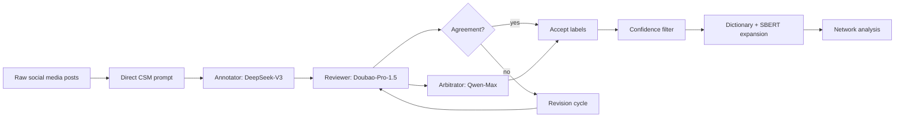
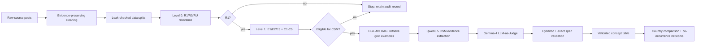
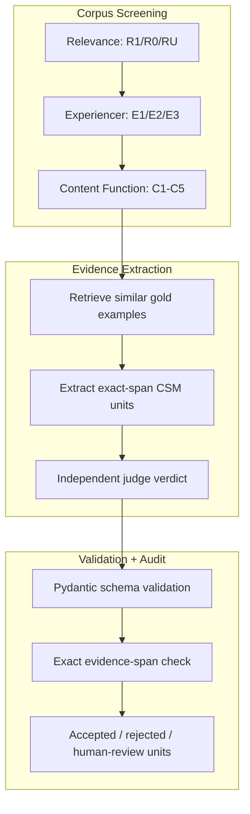
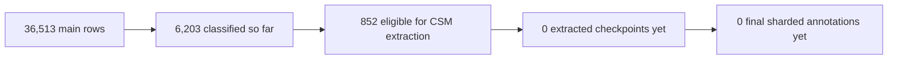
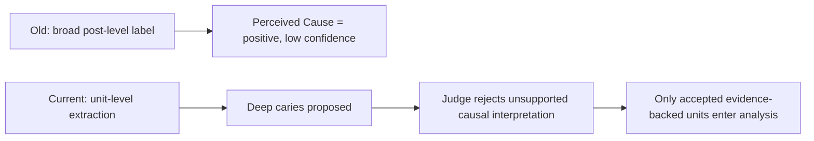
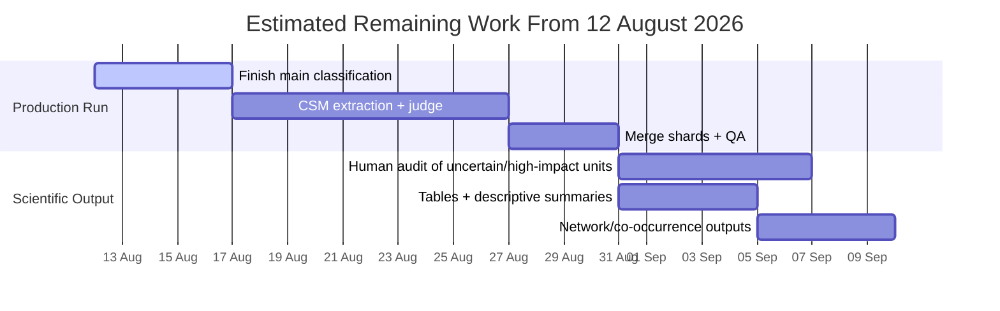

# Progress Update - 12 August 2026

## 1. Headline Status

| Area                 |                    Status | Evidence                                                                                                                                                                    |
| -------------------- | ------------------------: | --------------------------------------------------------------------------------------------------------------------------------------------------------------------------- |
| Methodology redesign |                  Complete | Current hierarchy implemented in[`dental_ai/pipeline.py`](dental_ai/pipeline.py), schemas in [`dental_ai/schemas.py`](dental_ai/schemas.py)                               |
| Local model stack    |                  Complete | [`configs/model_stack.yaml`](configs/model_stack.yaml)                                                                                                                     |
| Holdout validation   | Passed best completed run | 150/150 rows completed, 0 validation failures in[`outputs/hf_full_qwen3-5_9b_gemma4_12b_it/run_manifest.json`](outputs/hf_full_qwen3-5_9b_gemma4_12b_it/run_manifest.json) |
| Main pilot           |                    Passed | 100/100 rows completed, 0 validation failures in[`outputs/main_pilot_100_v2/run_manifest.json`](outputs/main_pilot_100_v2/run_manifest.json)                               |
| Main production run  |                   Started | 6,203 rows classified in[`outputs/main_pilot_10000_sharded_3gpu`](outputs/main_pilot_10000_sharded_3gpu)                                                                   |
| Next bottleneck      |                    Active | CSM extraction + judge pass for eligible rows                                                                                                                               |

**Bottom line:** the long development period produced a materially stronger architecture. We are now past architecture testing and have started processing the main corpus, but the production run is still early: classification has begun, while full extraction and judging are the next major work block.

## 2. Old vs Current Methodology

| Method Area       | Old Manuscript Method                                                | Current Method                                                                                       | Why This Is Better                                                                          |
| ----------------- | -------------------------------------------------------------------- | ---------------------------------------------------------------------------------------------------- | ------------------------------------------------------------------------------------------- |
| Core architecture | Multi-agent API workflow: Annotator -> Reviewer -> Arbitrator        | Hierarchical pipeline: relevance -> experiencer/function -> CSM extraction -> judge                  | Separates screening from medical narrative extraction                                       |
| Models            | DeepSeek-V3, Doubao-Pro-1.5, Qwen-Max APIs                           | Local HF stack: Qwen3-4B-it classifier, Qwen3.5-9B extractor, Gemma-4-12B-it judge, BGE-M3 retriever | Stronger open source models, more reproducible, lower external dependency, easier to rerun |
| CSM framework     | 6 domains including Social Interaction                               | 5 CSM domains; Social Interaction moved to content-function labels                                   | Avoids mixing publication purpose with illness-narrative content                            |
| Output object     | Post-level labels plus LLM reasoning/confidence                      | Evidence-grounded narrative units with exact source spans                                            | Easier to audit and defend                                                                  |
| Validation        | Prompt rotation, reviewer/arbitrator agreement, confidence filtering | Pydantic schema checks, exact-span containment, LLM-as-Judge, rule audit trail                       | Less dependent on self-reported confidence                                                  |
| Concept handling  | Seed dictionary + SBERT expansion                                    | Open extraction, then concept normalization                                                          | Preserves slang, local expressions, and new concepts                                        |
| Runtime           | Script chain and API calls                                           | Checkpointed, resumable, sharded local runs                                                          | Suitable for long production batches                                                        |

Source for old method: [`dental^LLMpain-pro-JMIR0522.docx`](dental^LLMpain-pro-JMIR0522.docx)
Supporting but partly outdated project plan: [`PROJECT-total.md`](PROJECT-total.md)

## 3. Architecture Change Diagram

### Old Workflow



### Current Workflow



## 4. Why Social Interaction Was Removed as a CSM Domain

| Old Six-Domain Label                                          | Current Location                         | Reason                                                       |
| ------------------------------------------------------------- | ---------------------------------------- | ------------------------------------------------------------ |
| Social Interaction: help-seeking                              | `C2 Question or Help-Seeking`          | This describes why the post was written                      |
| Social Interaction: advice or education                       | `C3 Health Knowledge Sharing`          | This is content function, not illness content                |
| Social Interaction: advertising                               | `C4 Advertising or Commercial Content` | This screens commercial intent before extraction             |
| Social Interaction: casual reaction/joke                      | `C5 Other`                             | This keeps low-information interaction out of CSM extraction |
| Actual symptom, coping, emotion, consequence in the same post | Five CSM extraction domains              | The illness narrative is still retained when evidence exists |

This change is important for construct validity. A post asking "What should I do about this toothache?" is no longer treated as a Social Interaction CSM concept. It is classified as `C2`, and any actual symptoms, daily-life effects, emotions, or planned coping actions are extracted separately from the source text.

## 5. Current Methodology in One View



### Current CSM Extraction Domains

| Domain                 | Extracted Only When There Is Source Evidence                              |
| ---------------------- | ------------------------------------------------------------------------- |
| Perceived Cause        | User-stated trigger or cause of pain                                      |
| Symptom Description    | Pain, swelling, inflammation, severity, timing                            |
| Perceived Consequences | Sleep, eating, study, work, cost burden, daily-life impact                |
| Coping and Management  | Medication, dental visit, extraction, root canal, self-care, planned care |
| Emotional Expression   | Fear, anxiety, distress, anger, relief, regret                            |

Core rule: **no exact source-text evidence span, no extraction.**

## 6. Data Dashboard

### Current Data Assets

| Asset               | Rows / Posts | Purpose                        | Link                                                                                  |
| ------------------- | -----------: | ------------------------------ | ------------------------------------------------------------------------------------- |
| Main no-gold corpus |  36,513 rows | Production annotation corpus   | [`data/raw_main_llm_input_no_gold.jsonl`](data/raw_main_llm_input_no_gold.jsonl)     |
| Evaluation holdout  |     150 rows | Locked evaluation / validation | [`data/raw_eval_holdout_150_no_gold.jsonl`](data/raw_eval_holdout_150_no_gold.jsonl) |
| Classification gold |     172 rows | Few-shot R/E/C calibration     | [`data/classification_gold_172.jsonl`](data/classification_gold_172.jsonl)           |
| CSM RAG gold        |     60 posts | Few-shot CSM extraction seeds  | [`data/csm_gold_50E1_10E2.json`](data/csm_gold_50E1_10E2.json)                       |
| Split manifest      |   1 manifest | Leak-check and split audit     | [`data/project_split_manifest.json`](data/project_split_manifest.json)               |

### Main Corpus Country Distribution

| Country / Corpus    |             Rows |          Share | Visual                           |
| ------------------- | ---------------: | -------------: | -------------------------------- |
| China / Xiaohongshu |            3,313 |           9.1% | `██`                         |
| Japan / X           |           25,168 |          68.9% | `██████████████` |
| Korea / X           |            8,032 |          22.0% | `████`                     |
| **Total**     | **36,513** | **100%** |                                  |

## 7. Validation Results So Far

| Run                  | Input        | Rows | Completed | Stage Errors | Validation Failures | Notes                                   |
| -------------------- | ------------ | ---: | --------: | -----------: | ------------------: | --------------------------------------- |
| Best full holdout    | Eval holdout |  150 |       150 |            0 |                   0 | Qwen3.5 extractor + Gemma-4 judge       |
| Main pilot           | Main corpus  |  100 |       100 |            0 |                   0 | First production-like main-corpus pilot |
| Earlier 30-row smoke | Eval holdout |   30 |        30 |            0 |                   0 | Confirmed latest model stack path       |
| Earlier 5-row smokes | Eval holdout |    5 |         5 |            0 |                   0 | Used for model/runtime testing          |

The best completed holdout run is documented in [`outputs/hf_full_qwen3-5_9b_gemma4_12b_it/run_manifest.json`](outputs/hf_full_qwen3-5_9b_gemma4_12b_it/run_manifest.json). The main pilot is documented in [`outputs/main_pilot_100_v2/run_manifest.json`](outputs/main_pilot_100_v2/run_manifest.json).

## 8. Main Pilot Output Snapshot

The 100-row main pilot is useful because it shows that the latest architecture works on the actual production distribution, not only the holdout file.

### Pilot Classification

| Label Group                      | Count |
| -------------------------------- | ----: |
| Toothache-relevant (`R1`)      |    89 |
| Not relevant (`R0`)            |    11 |
| Author experience (`E1`)       |    50 |
| Specific other person (`E2`)   |     1 |
| No specific experiencer (`E3`) |    38 |
| Experience-sharing (`C1`)      |    16 |
| Help-seeking (`C2`)            |     4 |
| Health knowledge (`C3`)        |    34 |
| Commercial (`C4`)              |    28 |
| Other (`C5`)                   |     7 |

### Pilot CSM Units

| Unit Outcome                    |         Count | Visual                               |
| ------------------------------- | ------------: | ------------------------------------ |
| Accepted by judge               |            82 | `████████████████` |
| Rejected by judge               |            24 | `█████`                       |
| Needs human review              |             7 | `█`                               |
| **Total extracted units** | **113** |                                      |

| CSM Domain             | Extracted Units |
| ---------------------- | --------------: |
| Coping and Management  |              39 |
| Symptom Description    |              34 |
| Emotional Expression   |              17 |
| Perceived Consequences |              13 |
| Perceived Cause        |              10 |

## 9. Production Run Funnel

Current sharded production directory:

[`outputs/main_pilot_10000_sharded_3gpu`](outputs/main_pilot_10000_sharded_3gpu)



| Production Metric                         | Current Count |
| ----------------------------------------- | ------------: |
| Main corpus rows                          |        36,513 |
| Classified rows in sharded run            |         6,203 |
| Remaining rows to classify                |  about 30,310 |
| Eligible CSM rows found so far            |           852 |
| Eligible CSM rate so far                  |         13.7% |
| Extraction checkpoint rows in sharded run |             0 |
| Final annotation rows in sharded run      |             0 |
| Row-level error records                   |             0 |
| Malformed checkpoint lines detected       |             1 |

Interpretation: production processing has started, but the current sharded run is still at the classification-checkpoint stage. The next operational priority is to resume/continue into extraction and judging, while handling the one malformed checkpoint line.

## 10. Example: Old vs New LLM Outputs

The historical old-method Excel/cache outputs are not present in this workspace. The comparison below therefore uses:

- a **representative old ABABC output shape** reconstructed from the old scripts and manuscript method;
- a **real current output** from [`outputs/main_pilot_100_v2/annotations.jsonl`](outputs/main_pilot_100_v2/annotations.jsonl);
- real current RAG trace rows from [`outputs/main_pilot_100_v2/retrieval_trace.jsonl`](outputs/main_pilot_100_v2/retrieval_trace.jsonl).

This uses the same input post to show how the architecture changed.

### 10.1 Same Input Post

| Field              | Value                                                                                                                                                                                                                                   |
| ------------------ | --------------------------------------------------------------------------------------------------------------------------------------------------------------------------------------------------------------------------------------- |
| `post_id`        | `CHI_64ecba0f00000000200005fb`                                                                                                                                                                                                        |
| Country / platform | China / Xiaohongshu                                                                                                                                                                                                                     |
| Title              | 补完牙之后面部神经很痛                                                                                                                                                                                                                  |
| Source text        | 看网上的 没有三叉神经痛那么痛 并且是持续性的疼痛 本来是一颗深龋的牙齿 没有痛觉 那天去补牙打麻醉药的时候就疼到整个人抽搐了 弄完之后慢慢疼起来 以为是药物刺激过一晚上会好的 结果越来越疼 疼到耳朵 有友友遇到过这种情况吗 已经持续两三天了 |

### 10.2 Old Method Output Shape: ABABC Multi-Agent Annotation

Under the old method, this post would have gone through the A1 -> B1 -> A2 -> B2 -> C workflow. The final object was organized by the six CSM dimensions, with labels, confidence, and reasoning. The trace could show which model supplied the final decision for each dimension, but the unit-level evidence was not the central validated object.

```json
{
  "post_id": "CHI_64ecba0f00000000200005fb",
  "Steps": {
    "A1": {
      "Symptom Description": {
        "label": 1,
        "confidence": 5,
        "reasoning": "The post describes continuous pain, increasing pain, pain radiating to the ear, and pain lasting two to three days."
      },
      "Perceived Cause": {
        "label": 1,
        "confidence": 4,
        "reasoning": "The author mentions a deep caries tooth and possible medication stimulation after dental filling."
      },
      "Coping and Management": {
        "label": 1,
        "confidence": 4,
        "reasoning": "The author received dental filling and anesthesia and waited overnight expecting improvement."
      },
      "Emotional Expression": {
        "label": 1,
        "confidence": 4,
        "reasoning": "The author expresses distress and asks whether others have had a similar situation."
      },
      "Perceived Consequences": {
        "label": 0,
        "confidence": 3,
        "reasoning": "No clear work, sleep, eating, or daily-life impairment is stated."
      },
      "Social Interaction": {
        "label": 1,
        "confidence": 5,
        "reasoning": "The author asks other users whether they have encountered this situation."
      }
    },
    "B1": {
      "is_correct": false,
      "dimension_feedback": {
        "Perceived Cause": "Partly overinterpreted; deep caries is mentioned but the post does not clearly state it caused the current pain.",
        "Social Interaction": "Correct under the old six-domain framework because the author asks peers for similar experience."
      }
    },
    "A2": {
      "Perceived Cause": {
        "label": 1,
        "confidence": 3,
        "reasoning": "The post suggests possible causes but the causal link is uncertain."
      }
    },
    "B2": {
      "dimension_feedback": {
        "Perceived Cause": "Still uncertain."
      }
    },
    "C": {
      "Perceived Cause": {
        "label": 1,
        "confidence": 3,
        "reasoning": "Final arbitration keeps this as a low-confidence perceived cause."
      }
    }
  },
  "Final_Output": {
    "Perceived Cause": {"label": 1, "confidence": 3},
    "Symptom Description": {"label": 1, "confidence": 5},
    "Perceived Consequences": {"label": 0, "confidence": 3},
    "Coping and Management": {"label": 1, "confidence": 4},
    "Emotional Expression": {"label": 1, "confidence": 4},
    "Social Interaction": {"label": 1, "confidence": 5}
  },
  "_final_source": {
    "Perceived Cause": "C",
    "Symptom Description": "A1",
    "Coping and Management": "A1",
    "Social Interaction": "A1"
  }
}
```

What this shows:

- The old output explains the model's logic, but the reasoning text is not directly machine-auditable.
- Social Interaction becomes a positive CSM domain because the author asks peers a question.
- A broad Perceived Cause label can survive arbitration even when the evidence is uncertain.
- Downstream users get post-level labels, but not a clean list of exact evidence-backed units.

### 10.3 Current Method Stage 1: Classification Output

The current method first classifies corpus eligibility and communicative function. At this stage, CSM extraction has not run yet, so the useful output is the R/E/C label set rather than the final `units` array.

```json
{
  "post_id": "CHI_64ecba0f00000000200005fb",
  "relevance_label": "R1",
  "experiencer_label": "E1",
  "content_function": "C1"
}
```

| Stage            | Output           | Meaning                           |
| ---------------- | ---------------- | --------------------------------- |
| Relevance        | `R1`           | Toothache/dental-pain relevant    |
| Experiencer      | `E1`           | Author's own experience           |
| Content function | `C1`           | Experience-sharing narrative      |
| CSM units        | not produced yet | Added later by extraction + judge |

This is already a methodological change: the peer-question aspect is handled through content function if it dominates. It is not treated as a sixth CSM domain.

### 10.4 Current Method Stage 2: RAG Retrieval Trace

Before extraction, the current pipeline retrieves similar adjudicated CSM gold examples. For this post, the first two retrieved examples were:

| Rank |  Score | Gold Post ID                     | Country | Language | Gold Labels |
| ---: | -----: | -------------------------------- | ------- | -------- | ----------- |
|    1 | 0.7554 | `XHS_6a5c9482000000000101c1b7` | CHI     | zh       | `E1 + C1` |
|    2 | 0.7440 | `XHS_682dd0b7000000002102c0aa` | CHI     | zh       | `E1 + C2` |

Why this matters:

- The model is calibrated by similar human-adjudicated cases.
- Retrieval is logged separately, so few-shot context is auditable.
- The extraction prompt is less free-floating than the old direct CSM prompt.

### 10.5 Current Method Stage 3: Evidence-Unit Extraction + Judge Output

The current final output stores each narrative claim as a separate unit. Selected units from the real output:

| Unit     | Domain                | Exact Evidence Span                             | Normalized Concept          | Judge  |
| -------- | --------------------- | ----------------------------------------------- | --------------------------- | ------ |
| `u001` | Symptom Description   | 没有三叉神经痛那么痛 并且是持续性的疼痛         | Continuous dental pain      | accept |
| `u002` | Symptom Description   | 疼到耳朵                                        | Referred orofacial pain     | accept |
| `u003` | Symptom Description   | 已经持续两三天了                                | Duration of dental pain     | accept |
| `u004` | Coping and Management | 弄完之后慢慢疼起来 以为是药物刺激过一晚上会好的 | Self-medication expectation | accept |
| `u005` | Emotional Expression  | 疼到整个人抽搐了                                | Severe pain reaction        | accept |
| `u006` | Perceived Cause       | 本来是一颗深龋的牙齿 没有痛觉                   | Deep caries                 | reject |
| `u007` | Coping and Management | 那天去补牙打麻醉药的时候就疼到整个人抽搐了      | Local anesthesia pain       | accept |

For this post, the extractor proposed 7 units. The judge accepted 6 and rejected 1. The important contrast is `u006`. Under the old approach, the model could keep "deep caries" as a low-confidence Perceived Cause after arbitration. Under the current approach, the extractor can propose it, but the judge rejects it because the exact span does not sufficiently support a present causal claim for the painful condition. This is exactly the kind of overinterpretation control that justifies the additional architecture.

### 10.6 Current Method Final Output Format

The final annotation object combines upstream R/E/C labels with the CSM evidence units. A compact version of the real final output for this example looks like this:

```json
{
  "post_id": "CHI_64ecba0f00000000200005fb",
  "country": "CHI",
  "language": "zh",
  "platform": "xiaohongshu",
  "relevance_label": "R1",
  "experiencer_label": "E1",
  "content_function": "C1",
  "units": [
    {
      "unit_id": "CHI_64ecba0f00000000200005fb_u001",
      "domain": "Symptom Description",
      "evidence_span_original": "没有三叉神经痛那么痛 并且是持续性的疼痛",
      "surface_text_working": "持续性疼痛，比三叉神经痛轻",
      "normalized_concept_en": "Continuous dental pain",
      "concept_status": "new_candidate",
      "support_type": "explicit",
      "assertion": "present",
      "temporality": "current",
      "sentiment_or_outcome": "negative",
      "confidence": 0.99,
      "judge_verdict": "accept"
    },
    {
      "unit_id": "CHI_64ecba0f00000000200005fb_u002",
      "domain": "Symptom Description",
      "evidence_span_original": "疼到耳朵",
      "surface_text_working": "疼痛放射至耳朵",
      "normalized_concept_en": "Referred orofacial pain",
      "concept_status": "new_candidate",
      "support_type": "explicit",
      "assertion": "present",
      "temporality": "current",
      "sentiment_or_outcome": "negative",
      "confidence": 0.99,
      "judge_verdict": "accept"
    },
    {
      "unit_id": "CHI_64ecba0f00000000200005fb_u003",
      "domain": "Symptom Description",
      "evidence_span_original": "已经持续两三天了",
      "surface_text_working": "疼痛持续两三天",
      "normalized_concept_en": "Duration of dental pain",
      "concept_status": "new_candidate",
      "support_type": "explicit",
      "assertion": "present",
      "temporality": "current",
      "sentiment_or_outcome": "negative",
      "confidence": 0.99,
      "judge_verdict": "accept"
    },
    {
      "unit_id": "CHI_64ecba0f00000000200005fb_u004",
      "domain": "Coping and Management",
      "evidence_span_original": "弄完之后慢慢疼起来 以为是药物刺激过一晚上会好的",
      "surface_text_working": "以为是药物刺激，期待过一晚好转",
      "normalized_concept_en": "Self-medication expectation",
      "concept_status": "new_candidate",
      "support_type": "explicit",
      "assertion": "present",
      "temporality": "past",
      "sentiment_or_outcome": "ineffective",
      "confidence": 0.99,
      "judge_verdict": "accept"
    },
    {
      "unit_id": "CHI_64ecba0f00000000200005fb_u005",
      "domain": "Emotional Expression",
      "evidence_span_original": "疼到整个人抽搐了",
      "surface_text_working": "疼痛导致全身抽搐",
      "normalized_concept_en": "Severe pain reaction",
      "concept_status": "new_candidate",
      "support_type": "explicit",
      "assertion": "present",
      "temporality": "past",
      "sentiment_or_outcome": "negative",
      "confidence": 0.99,
      "judge_verdict": "accept"
    },
    {
      "unit_id": "CHI_64ecba0f00000000200005fb_u006",
      "domain": "Perceived Cause",
      "evidence_span_original": "本来是一颗深龋的牙齿 没有痛觉",
      "surface_text_working": "深龋牙齿无自觉痛",
      "normalized_concept_en": "Deep caries",
      "concept_status": "new_candidate",
      "support_type": "explicit",
      "assertion": "present",
      "temporality": "past",
      "sentiment_or_outcome": "neutral",
      "confidence": 0.99,
      "judge_verdict": "reject"
    },
    {
      "unit_id": "CHI_64ecba0f00000000200005fb_u007",
      "domain": "Coping and Management",
      "evidence_span_original": "那天去补牙打麻醉药的时候就疼到整个人抽搐了",
      "surface_text_working": "补牙打麻药时剧痛抽搐",
      "normalized_concept_en": "Local anesthesia pain",
      "concept_status": "new_candidate",
      "support_type": "explicit",
      "assertion": "present",
      "temporality": "past",
      "sentiment_or_outcome": "negative",
      "confidence": 0.99,
      "judge_verdict": "accept"
    }
  ]
}
```

For downstream analysis, the accepted CSM units are retained and the rejected unit is excluded from medical concept counts and network construction, while still remaining visible for audit.

### 10.7 Side-by-Side Difference

| Question                                                         | Old ABABC Method                           | Current Hierarchical Method                                             |
| ---------------------------------------------------------------- | ------------------------------------------ | ----------------------------------------------------------------------- |
| What is the primary output?                                      | Post-level six-domain labels               | Post-level R/E/C labels plus exact-span CSM units                       |
| Where does help-seeking/social interaction go?                   | `Social Interaction = 1`                 | Content function, e.g.`C2` if help-seeking dominates                  |
| Can a broad domain be positive without a specific accepted unit? | Yes                                        | No for downstream CSM analysis                                          |
| Is every concept tied to exact source text?                      | Not centrally enforced                     | Yes                                                                     |
| Can the system reject an overinterpreted extracted concept?      | Only through reviewer/arbitrator reasoning | Yes, via unit-level judge verdict                                       |
| Can retrieval context be audited?                                | Not part of core output                    | Yes,`retrieval_trace.jsonl`                                           |
| Can failed or uncertain cases be resumed?                        | Cache-based, script-specific               | Checkpointed at classification, extraction, and final annotation stages |

### 10.8 Why This Example Justifies the Extra Effort

This one post shows the practical reason for the redesign:



The old workflow was optimized for agreement and confidence. The current workflow is optimized for traceability. That is a better fit for a multilingual health narrative study because downstream claims can be checked against original source text instead of relying on LLM reasoning alone.

## 11. Main Bottlenecks and Drags

| Bottleneck                | What Happened                                                             | Why It Was Necessary                                                |
| ------------------------- | ------------------------------------------------------------------------- | ------------------------------------------------------------------- |
| Codebook redesign         | Moved from six CSM domains to R/E/C + five CSM domains                    | Prevented Social Interaction from overlapping with content function |
| Gold-set preparation      | Built 172 classification-gold rows and 60 CSM gold posts                  | Needed for few-shot calibration and RAG extraction                  |
| Boundary prompt hardening | Repeated prompt and post-processing updates for C2/C3/C4/C5 and E1/E2/E3  | Reduced predictable classification errors before scaling            |
| Evidence-span enforcement | Added schemas, exact-span checks, unit IDs, validation reports            | Made extraction auditable and reviewer-defensible                   |
| Local model migration     | Replaced API dependence with local HF models                              | Improved reproducibility and cost control                           |
| GPU/runtime engineering   | Added 8-bit loading, one-model-at-a-time execution, checkpointing, resume | Required for long jobs on available hardware                        |
| Sharding                  | Added shard runner and merge script                                       | Needed to process the main corpus in parallel                       |
| Log growth                | Quantization warnings produced large logs                                 | Recent fix limits storage growth during long runs                   |

Relevant implementation links:

- Pipeline hierarchy: [`dental_ai/pipeline.py`](dental_ai/pipeline.py)
- Batch runner and checkpointing: [`dental_ai/run.py`](dental_ai/run.py)
- Local HF model clients: [`dental_ai/local_models.py`](dental_ai/local_models.py)
- Prompts: [`dental_ai/prompts.py`](dental_ai/prompts.py)
- RAG retriever: [`dental_ai/rag.py`](dental_ai/rag.py)
- Validation: [`dental_ai/validate.py`](dental_ai/validate.py)
- Sharded runtime: [`scripts/run_hf_shards.sh`](scripts/run_hf_shards.sh)
- Shard merge: [`scripts/merge_hf_shards.py`](scripts/merge_hf_shards.py)
- Progress summary helper: [`scripts/summarize_hf_progress.py`](scripts/summarize_hf_progress.py)

## 12. Timeline and Completion Estimate



### Practical Estimate

| Work Block                    |  Estimate | Dependency                                     |
| ----------------------------- | --------: | ---------------------------------------------- |
| Finish classification         |  3-5 days | Stable sharded GPU runtime                     |
| Extraction + judging          | 5-10 days | Classification checkpoints and model stability |
| Merge, QA, validation reports |  2-4 days | Completed shards                               |
| Human audit                   |  3-7 days | Reviewer availability                          |
| Tables and network outputs    |  3-5 days | Final validated annotation table               |

**Best current estimate:** first analysis-ready outputs in about **2-3 weeks** from 12 August 2026.
**More conservative estimate:** audited manuscript-ready tables/figures in about **3-4 weeks**, assuming stable GPU availability and no major extraction-quality regression.

## 13. Stakeholder-Ready Summary

The project has changed substantially since the old manuscript draft. The previous method used a broad multi-agent LLM workflow to label six CSM domains directly. We have rebuilt that into a hierarchical, evidence-grounded, locally reproducible pipeline.

This redesign took time because we had to resolve conceptual overlap, prepare gold sets, harden prompts against boundary cases, enforce exact source-text evidence, migrate from APIs to local models, and add the engineering needed for long sharded runs.

The benefit is that the current method is much easier to defend. It separates relevance screening, experiencer/function classification, CSM extraction, and judge validation. It also keeps every extracted concept traceable to the original Chinese, Japanese, or Korean text.

The architecture is now stable enough for real data. Holdout and pilot runs have completed successfully, and production processing has started. As of this update, 6,203 main-corpus rows have been classified and 852 have been identified for CSM extraction. The remaining work is mainly production throughput, extraction/judging, shard merge, QA, and final analysis outputs.
