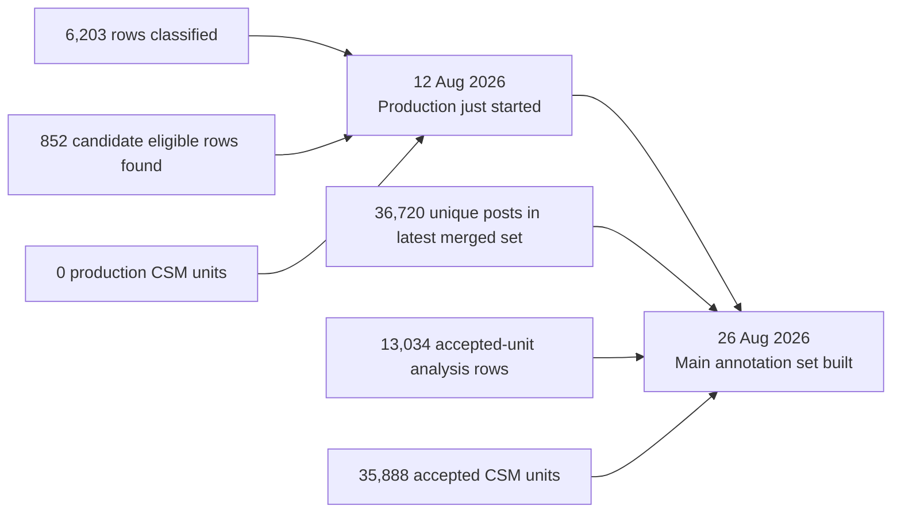
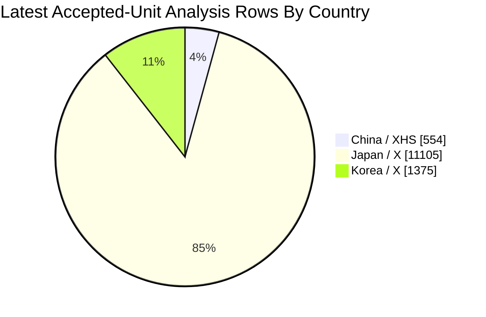
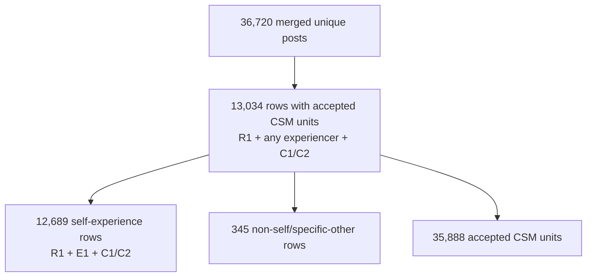
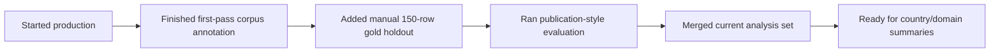
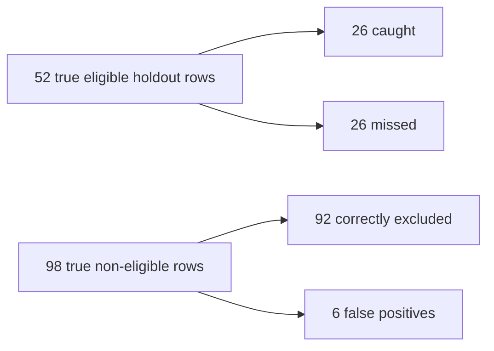
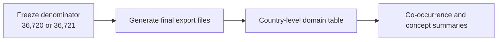

# Progress Update - 26 August 2026

## 1. Two-Snapshot Summary

**Plain-language status:** on 12 August, the production run had only started. Today, the main corpus has been annotated and merged into a usable analysis set. The latest numbers below include the later second-look pass, but this report treats it simply as part of the current merged output rather than as a separate workflow.

## 2. Main Stats: 12 Aug vs Today

| Metric                                       |        12 Aug 2026 |                         26 Aug 2026 |
| -------------------------------------------- | -----------------: | ----------------------------------: |
| Main corpus rows                             |             36,513 |                              36,721 |
| Final/merged unique posts                    |  0 production rows |                              36,720 |
| Rows classified in production                |              6,203 |                              36,720 |
| Rows flagged as CSM-eligible/candidate       |   852 found so far | 13,034 rows with accepted CSM units |
| Self-experience rows with accepted CSM units |  0 production rows |                              12,689 |
| Accepted CSM units                           | 0 production units |                              35,888 |
| Main remaining gap                           |  about 30,310 rows |                               1 row |

## 3. Latest Accepted Rows By Country

These are the current analysis rows: `R1` toothache-relevant, `C1/C2` experience/help-seeking, and at least one judge-accepted CSM unit.

| Country / Corpus    | Rows With Accepted CSM Units | Share Of Accepted Rows | Visual                                       |
| ------------------- | ---------------------------: | ---------------------: | -------------------------------------------- |
| China / Xiaohongshu |                          554 |                   4.3% | `█`                                       |
| Japan / X           |                       11,105 |                  85.2% | `█████████████████`       |
| Korea / X           |                        1,375 |                  10.5% | `██`                                     |
| **Total**     |             **13,034** |         **100%** | `████████████████████` |

## 4. Latest Analysis Set

| Analysis Set                                                |   Rows |
| ----------------------------------------------------------- | -----: |
| All merged unique posts                                     | 36,720 |
| `R1`, any experiencer, `C1/C2`, with accepted units     | 13,034 |
| `R1`, `E1`, `C1/C2`, with accepted units              | 12,689 |
| Difference: non-self/specific-other included in broader set |    345 |
| Accepted CSM units in latest merged set                     | 35,888 |

## 5. What Changed Since 12 Aug

| Change                                                                    | Why It Matters                                            |
| ------------------------------------------------------------------------- | --------------------------------------------------------- |
| Corpus expanded by 208 China rows                                         | Current denominator is now 36,721, not 36,513             |
| Production output moved from partial classification to merged annotations | The project now has usable post-level and unit-level data |
| Accepted-unit analysis rows are available by country                      | Country comparison can begin from a concrete denominator  |
| 150-row manual holdout was added                                          | Validation can now be reported with paper-facing metrics  |
| Export tooling exists for the merged analysis set                         | Results tables can be generated without hand-counting     |

## 6. Validation Snapshot

| Metric From 150-Row Gold Holdout |     Value |
| -------------------------------- | --------: |
| Matched holdout rows             | 150 / 150 |
| Eligibility precision            |    0.8125 |
| Eligibility recall               |    0.5000 |
| Eligibility F1                   |    0.6190 |
| Classification exact accuracy    |    0.5867 |
| CSM domain macro F1              |    0.3684 |
| Evidence-span support rate       |    0.9899 |
| Accepted unit rate               |    0.7576 |

## 7. Key Evidence Files

| Evidence                         | Path                                                                                                                                |
| -------------------------------- | ----------------------------------------------------------------------------------------------------------------------------------- |
| 12 Aug checkpoint                | [`progress_update_12_08_2026.md`](progress_update_12_08_2026.md)                                                                   |
| Latest report                    | [`progress_update_26_08_2026.md`](progress_update_26_08_2026.md)                                                                   |
| Split/corpus manifest            | [`data/project_split_manifest.json`](data/project_split_manifest.json)                                                             |
| First 10k merged manifest        | [`outputs/main_pilot_10000_sharded_3gpu_merged/run_manifest.json`](outputs/main_pilot_10000_sharded_3gpu_merged/run_manifest.json) |
| Second 10k merged manifest       | [`outputs/main_pilot_20000_sharded_3gpu_merged/run_manifest.json`](outputs/main_pilot_20000_sharded_3gpu_merged/run_manifest.json) |
| Remaining corpus merged manifest | [`outputs/main_pilot_36k_sharded_3gpu_merged/run_manifest.json`](outputs/main_pilot_36k_sharded_3gpu_merged/run_manifest.json)     |
| Export summary generator         | [`scripts/merge_export.py`](scripts/merge_export.py)                                                                               |
| Manual holdout summary           | [`data/raw_eval_holdout_150_gold.summary.json`](data/raw_eval_holdout_150_gold.summary.json)                                       |

## 8. Next Practical Step

The immediate job is to freeze the final denominator and regenerate/export the current merged analysis tables so the manuscript results use one clear set of numbers.
